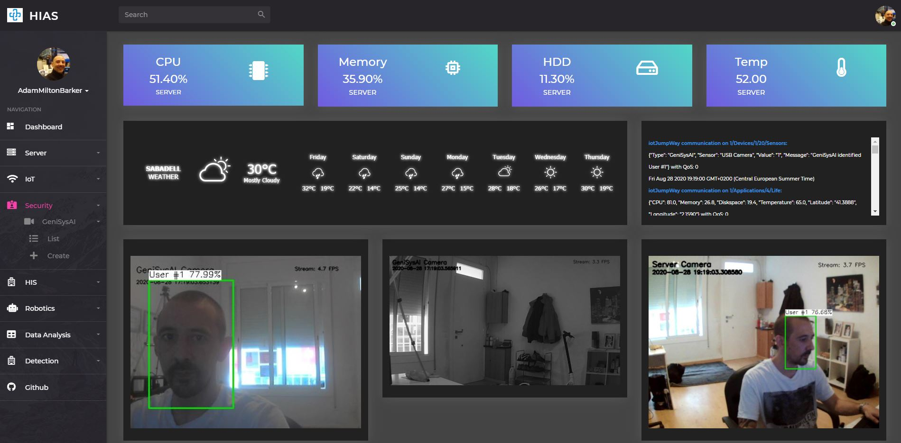
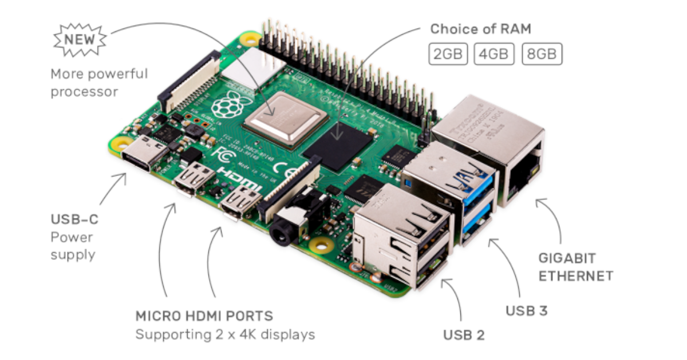

# Asociacion De Investigacion En Inteligencia Artificial Para La Leucemia Peter Moss
## HIAS TassAI Facial Recognition Security Systems

      

&nbsp;

# Table Of Contents

- [Introduction](#introduction)
- [Hardware](#hardware)
    - [UP2 (UP Squared)](#up2-up-squared)
    - [Raspberry Pi](#raspberry-pi)
- [Vision Hardware](#vision-hardware)
    - [Intel® Movidius™ Neural Compute Stick](#intel-movidius-neural-compute-stick)
    - [Intel® Movidius™ Neural Compute Stick 2](#intel-movidius-neural-compute-stick-2)
- [Vision Software](#vision-software)
    - [Intel® Movidius™ NCSDK](#intel-movidius-ncsdk)
    - [Intel® OpenVINO™ Toolkit](#intel-openvino-toolkit)
- [Vision Projects](#vision-projects)
    - [UP2 Vision Projects](#up2-vision-projects)
- [Contributing](#contributing)
    - [Contributors](#contributors)
- [Versioning](#versioning)
- [License](#license)
- [Bugs/Issues](#bugs-issues)

&nbsp;

# Introduction
Security is an important issue for hospitals and medical centers to consider. Today's Facial Recognition can provide ways of automating security in the medical industry, reducing staffing costs and making medical facilities safer for both patients and staff.

The Facial Recognition Security Systems projects provided in this repository are based on the [GeniSysAI Vision](https://github.com/GeniSysAI/Vision) projects, the successor of [TassAI](https://github.com/TassAI). The systems are IoT connected via the HIAS local [iotJumpWay](https://wwww.iotjumpway.com) broker allowing device to device communication that can provide automated responses to identified users or intruders.

&nbsp;

# Hardware
HIAS GeniSysAI devices are designed to be used on popular low powered, IoT devices such as **Raspberry Pi** and **Aaeon's UP2 (Up Squared)**. This makes them easy to use and affordable.

## UP2 (UP Squared)

UP2 by **Aaeon** are also popular with the IoT and AI communities. Unlike the Raspberry Pi, the UP2 have Intel Pentium quad-core processors. The UP2 are bigger than the Raspberry Pi, but are also more expensive.

## Raspberry Pi

Raspberry Pi by the **Raspberry Pi Foundation** are the most popular of the available mini ARM computers. RPIs provide easily affordable single board computers that have been widely adopted by the IoT and AI communities. The HIAS GeniSysAI projects suppory Raspberry Pi 3 and 4.

&nbsp;

# Vision Hardware
We use Intel® hardware to maximize performance of the HIAS GeniSysAI Facial Recognition Security Systems. You can find out more about these hardwares in this section.

## Intel® Movidius™ Neural Compute Stick

The Intel® Movidius™ Neural Compute Stick is a USB plug & play AI device for deep learning inference at the edge. The Intel® Movidius™ Neural Compute Stick is built on the Intel® Movidius™ Myriad™ 2 VPU which features 12 programmable shave cores for vision neural network acceleration.

## Intel® Movidius™ Neural Compute Stick 2

The Intel® Movidius™ Neural Compute Stick 2 is a USB plug & play AI device for deep learning inference at the edge. Combined with the Intel® OpenVINO™ Toolkit, developers can develop, fine-tune, and deploy convolutional neural networks (CNNs) on low-power applications that require real-time inference.

&nbsp;

# Vision Software
We use Intel® SKDs and Toolkits to maximize performance of the HIAS GeniSysAI Facial Recognition Security Systems. You can find out more about these softwares in this section.

## Intel® Movidius™ NCSDK
For the oldskool Neural Compute Stick developers, we have revived the original GeniSysAI [NCSDK](https://movidius.github.io/ncsdk/) projects. NCSDK was the first Intel SDK for the Neural Compute Stick 1 and provided the software for converting models created with a range of AI frameworks into graphs that are compatible with the NCS1.

## Intel® OpenVINO™ Toolkit
The [Intel® OpenVINO™ Toolkit](https://software.intel.com/content/www/us/en/develop/tools/openvino-toolkit.html) is Intel's latest contribution to computer vision developers. The toolkit is based on Convolutional Neural Network and optimizes models used on Intel CPUs/GPUs, VPUs, FPGA etc. Models are converted to [Intermediate Representations (IR)](https://docs.openvinotoolkit.org/latest/openvino_docs_MO_DG_IR_and_opsets.html) which allow them to be used with the [Inference Engine](https://docs.openvinotoolkit.org/2020.2/_docs_IE_DG_Deep_Learning_Inference_Engine_DevGuide.html).

&nbsp;

# Vision Projects
Below you will find details of the Facial Recognition Security System projects provided in this repository.

## UP2 Vision Projects

### Neural Compute Stick 1

| Project   | Description                                                                                                                                                                                                                                                                                                                                                                                                                                                                                                                                 |
| --- |------------------------------------------------------------------------------------------------------------------------------------------------------------------------------------------------------------------------------------------------------------------------------------------------------------------------------------------------------------------------------------------------------------------------------------------------------------------------------------------------------------------------------------------- |
| [UP2 NCS1 API](UP2/NCS1/API "UP2 NCS1 API")   | The UP2 NCS1 Facial API Security System hosts API endpoints exposing a Facenet classifier that uses Neural Compute Stick 1 for remote Facial Recognition requests.  |
| [UP2 NCS1 Foscam](UP2/NCS1/Foscam "UP2 NCS1 Foscam")   | The UP2 NCS1 Foscam Security System connects to a Foscam IP camera exposing a Facenet classifier that uses Neural Compute Stick 1 to provide Facial Recognition. |
| [UP2 NCS1 Realsense F200](UP2/NCS1/Realsense/F200 "UP2 NCS1 Realsense F200")   | The UP2 NCS1 Realsense F200 Security System connects to a Realsense F200 camera exposing a Facenet classifier that uses Neural Compute Stick 1 to provide Facial Recognition.  |
| [UP2 NCS1 USB Camera](UP2/NCS1/USBCam "UP2 NCS1 USB Camera")   | The UP2 NCS1 USB Camera Security System connects to a USB camera exposing a Facenet classifier that uses Neural Compute Stick 1 to provide Facial Recognition.   |

### OpenVINO Neural Compute Stick 1 & 2

| Project   | Description                                                                                                                                                                                                                                                                                                                                                                                                                                                                                                                                 |
| --- |------------------------------------------------------------------------------------------------------------------------------------------------------------------------------------------------------------------------------------------------------------------------------------------------------------------------------------------------------------------------------------------------------------------------------------------------------------------------------------------------------------------------------------------- |
| [UP2 OpenVINO Foscam Camera](UP2/OpenVINO/Foscam "UP2 OpenVINO Foscam Camera")   | The UP2 OpenVINO USB Camera Security System connects to a Foscam IP camera and uses facial detection/facial reidentification and facial landmark classifiers to provide Facial Recognition on VPU (Neural Compute Stick 1 & 2).   |
| [UP2 OpenVINO USB Camera](UP2/OpenVINO/USBCam "UP2 OpenVINO USB Camera")   | The UP2 OpenVINO USB Camera Security System connects to a USB camera and uses facial detection/facial reidentification and facial landmark classifiers to provide Facial Recognition on VPU (Neural Compute Stick 1 & 2).   |

&nbsp;

# Contributing

Asociacion De Investigacion En Inteligencia Artificial Para La Leucemia Peter Moss encourages and welcomes code contributions, bug fixes and enhancements from the Github community.

Please read the [CONTRIBUTING](CONTRIBUTING.md "CONTRIBUTING") document for a full guide to forking our repositories and submitting your pull requests. You will also find information about our code of conduct on this page.

## Contributors

- [Adam Milton-Barker](https://www.leukemiaresearchassociation.ai/team/adam-milton-barker "Adam Milton-Barker") - [Asociacion De Investigacion En Inteligencia Artificial Para La Leucemia Peter Moss](https://www.leukemiaresearchassociation.ai "Asociacion De Investigacion En Inteligencia Artificial Para La Leucemia Peter Moss") President & Lead Developer, Sabadell, Spain

&nbsp;

# Versioning

We use SemVer for versioning. For the versions available, see [Releases](releases "Releases").

&nbsp;

# License

This project is licensed under the **MIT License** - see the [LICENSE](LICENSE "LICENSE") file for details.

&nbsp;

# Bugs/Issues

We use the [repo issues](issues "repo issues") to track bugs and general requests related to using this project. See [CONTRIBUTING](CONTRIBUTING.md "CONTRIBUTING") for more info on how to submit bugs, feature requests and proposals.