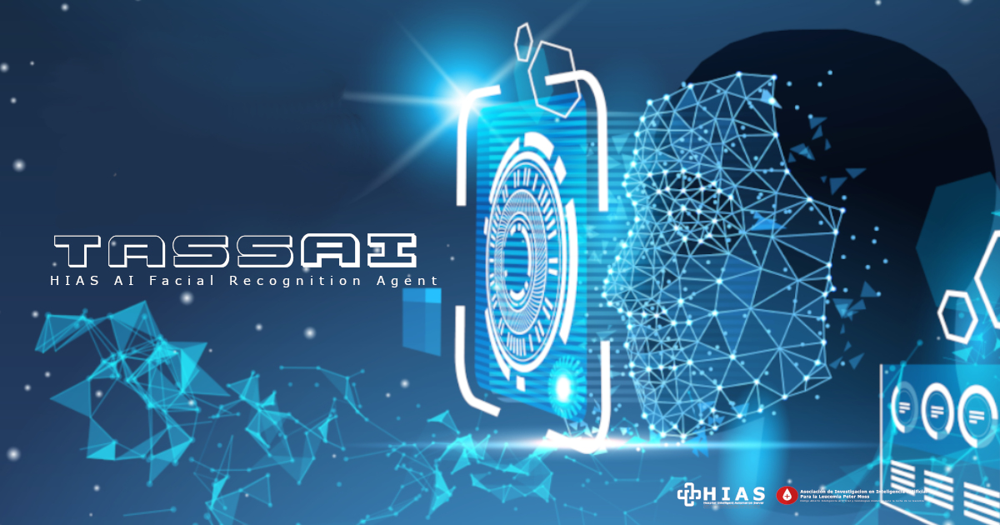

# Asociación de Investigacion en Inteligencia Artificial Para la Leucemia Peter Moss
## HIAS TassAI Facial Recognition Agent

        
 

&nbsp;

# Table Of Contents

- [Introduction](#introduction)
- [Intel® Movidius™ Neural Compute Stick 1](#intel-movidius-neural-compute-stick-1)
- [Intel® Movidius™ Neural Compute Stick 2](#intel-movidius-neural-compute-stick-2)
- [GETTING STARTED](#getting-started)
- [Contributing](#contributing)
  - [Contributors](#contributors)
- [Versioning](#versioning)
- [License](#license)
- [Bugs/Issues](#bugs-issues)

&nbsp;

# Introduction

Security is an important issue for hospitals and medical centers to consider. Today's Facial Recognition can provide ways of automating security in the medical industry, reducing staffing costs and making medical facilities safer for both patients and staff.

**HIAS TassAI Facial Recognition Agent** processes streams from **USB connected cameras** and uses **facial detection**/**facial reidentification** and a **facial landmark classifier** powered by **OpenVINO**, allowing inference on the **CPU** or **VPU** (**Intel® Movidius™ Neural Compute Stick** or **Intel® Neural Compute Stick 2**) to identify known and unknown humans.

Once TassAI identifies a known person or an intruder it can communicate with other devices and applications on the HIAS network, for example, it could send a request to the [HIAS GeniSysAI NLP Agent](https://github.com/AIIAL/HIAS-GeniSysAI-NLP-Agent) and start communication with the person, or sound an alarm in the event of an intruder.

&nbsp;

# Intel® Movidius™ Neural Compute Stick 1

In this project we use the The Intel® Movidius™ product is a USB appliance that can be plugged into low-powered edge devices such as Raspberry Pi and UP Squared, and basically takes the processing off the CPU and onto the Intel Movidius brand chip, decreasing inference times.

&nbsp;

# Intel® Movidius™ Neural Compute Stick 2

The Intel® Movidius™ Neural Compute Stick 2 is the latest version of the Neural Compute Stick.

&nbsp;

# GETTING STARTED

To get started head to the [documenation](docs/index.md) guide.

&nbsp;

# Contributing
Asociación de Investigacion en Inteligencia Artificial Para la Leucemia Peter Moss encourages and welcomes code contributions, bug fixes and enhancements from the Github community.

Please read the [CONTRIBUTING](CONTRIBUTING.md "CONTRIBUTING") document for a full guide to forking our repositories and submitting your pull requests. You will also find our code of conduct in the [Code of Conduct](CODE-OF-CONDUCT.md) document.

## Contributors
- [Adam Milton-Barker](https://www.leukemiaairesearch.com/association/volunteers/adam-milton-barker "Adam Milton-Barker") - [Asociación de Investigacion en Inteligencia Artificial Para la Leucemia Peter Moss](https://www.leukemiaresearchassociation.ai "Asociación de Investigacion en Inteligencia Artificial Para la Leucemia Peter Moss") President/Founder & Lead Developer, Sabadell, Spain

&nbsp;

# Versioning
We use [SemVer](https://semver.org/) for versioning.

&nbsp;

# License
This project is licensed under the **MIT License** - see the [LICENSE](LICENSE "LICENSE") file for details.

&nbsp;

# Bugs/Issues
We use the [repo issues](issues "repo issues") to track bugs and general requests related to using this project. See [CONTRIBUTING](CONTRIBUTING.md "CONTRIBUTING") for more info on how to submit bugs, feature requests and proposals.