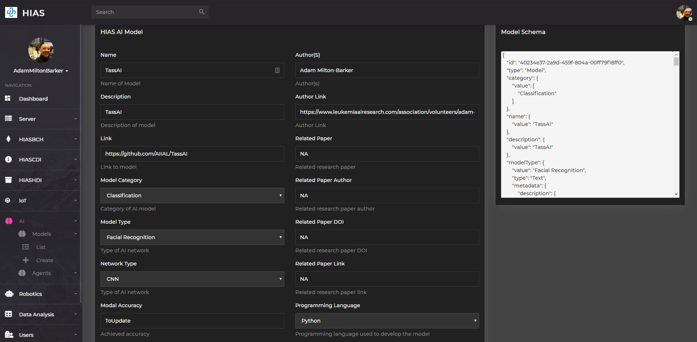
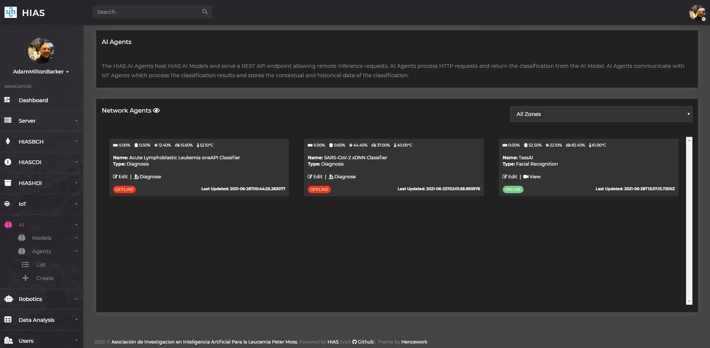
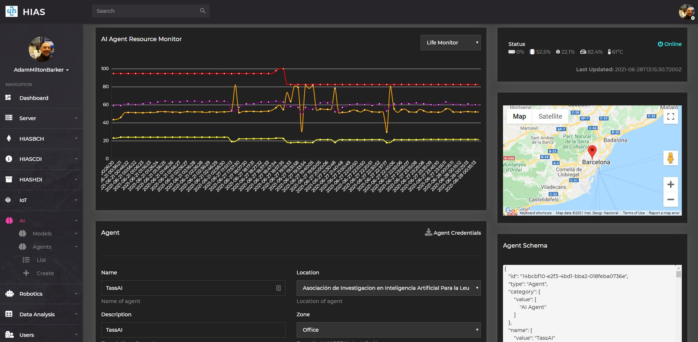

# Installation (USB Camera Mode)


# Introduction
This installation guide provides a step by step guide that takes you through the installation process for the **HIAS TassAI Facial Recognition Agent (USB Camera Mode)**.

&nbsp;

# Prerequisites
For this project you will need to ensure you have the following prerequisites installed and running.

## HIAS Core

The **HIAS TassAI Facial Recognition Agent** is a core component of the [HIAS - Hospital Intelligent Automation Server](https://github.com/AIIAL/HIAS-Core). Before beginning this tutorial you should complete the HIAS installation guide and have your HIAS server online. The HIAS Core installation installs the core components of the HIAS server: [HIASBCH](https://github.com/AIIAL/HIASBCH), [HIASHDI](https://github.com/AIIAL/HIASHDI) and [HIASCDI](https://github.com/AIIAL/HIASCDI).

## HIAS IoT Agent

You will need either a [HIAS MQTT IoT Agent](https://github.com/AIIAL/HIAS-MQTT-IoT-Agent) or [HIAS AMQP IoT Agent](https://github.com/AIIAL/HIAS-AMQP-IoT-Agent) installed on your HIAS Network. IoT Agents receive data sent from HIAS Network devices and applications and store the data in HIASCDI and HIASHDI.

## HIASBCH Blockchain Agent

You will need a [HIASBCH MQTT Blockchain Agent](https://github.com/AIIAL/HIASBCH-MQTT-Blockchain-Agent) installed on your HIAS Network. Blockchain Agents receive data from the IoT Agents and store immutable hashes of the data they receive. Please note, there is currently no Blockchain Agent for the AMQP protocol.

&nbsp;

# Operating System
The **HIAS TassAI Facial Recognition Agent** supports the following operating system(s):

- Ubuntu 18.04

&nbsp;

# Software
The **HIAS TassAI Facial Recognition Agent** project uses the following libraries.

- UFW firewall
- Intel® Distribution of OpenVINO™ Toolkit
- scikit-build
- opencv-python
- dlib
- imutils
- jsonpickle
- paho-mqtt
- psutil
- zmq

This software is installed when you run the installation script later on in this tutorial.

&nbsp;

# Installation
You are now ready to install the **HIAS TassAI Facial Recognition Agent** software.

## Clone the repository

Clone the [**HIAS TassAI Facial Recognition Agent**](https://github.com/AIIAL/HIAS-TassAI-Facial-Recognition-Agent " **HIAS TassAI Facial Recognition Agent**") repository from the [Asociación de Investigacion en Inteligencia Artificial Para la Leucemia Peter Moss](https://github.com/AIIAL "Asociación de Investigacion en Inteligencia Artificial Para la Leucemia Peter Moss") Github Organization.

To clone the repository and install the project, make sure you have Git installed. Now navigate to to your home directory and use the following command.

``` bash
 git clone https://github.com/AIIAL/HIAS-TassAI-Facial-Recognition-Agent.git
```

This will clone the **HIAS TassAI Facial Recognition Agent** repository.

``` bash
 ls
```

Using the ls command in your home directory should show you the following.

``` bash
 HIAS-TassAI-Facial-Recognition-Agent
```

Navigate into the **HIAS-TassAI-Facial-Recognition-Agent** directory, this is your project root directory for this tutorial.

### Developer forks

Developers from the Github community that would like to contribute to the development of this project should first create a fork, and clone that repository. For detailed information please view the [CONTRIBUTING](https://github.com/AIIAL/HIAS-TassAI-Facial-Recognition-Agent/blob/master/CONTRIBUTING.md "CONTRIBUTING") guide. You should pull the latest code from the development branch.

``` bash
 git clone -b "1.0.0" https://github.com/AIIAL/HIAS-TassAI-Facial-Recognition-Agent.git
```

The **-b "1.0.0"** parameter ensures you get the code from the latest dev branch. Before using the below command please check our latest dev branch shown in the **UPCOMING RELEASE** badge at the top of the project README.

## UFW Firewall
UFW firewall is used to protect the ports of your device. Use the following command to check the status of your firewall:

``` bash
  sudo ufw status
```
You should see the output:
``` bash
  Status: inactive
```

The default port is set to **8080** for the streaming port.

To allow access to the ports use the following command for each of your ports:

``` bash
  sudo ufw allow 22
  sudo ufw allow 8080
  audo ufw enable
  sudo ufw status
```

You should see the following output:

```
  Status: active

  To                         Action      From
  --                         ------      ----
  22                         ALLOW       Anywhere
  8080                       ALLOW       Anywhere
  22 (v6)                    ALLOW       Anywhere (v6)
  8080 (v6)                  ALLOW       Anywhere (v6)
```

## Intel® Distribution of OpenVINO™ Toolkit

For this project we will install OpenVINO 2020.3 as it is the final version that works with NCS1 which will be used in another project in this repository.

Follow the steps on [this link](https://software.seek.intel.com/openvino-toolkit?os=linux) to download OpenVINO, making sure you choose 2020.3.

Make sure the compressed folder is in you user home directory and use the following steps:

``` bash
  tar -xvzf l_openvino_toolkit_p_2020.3.194.tgz
  cd l_openvino_toolkit_p_2020.3.194
  sudo ./install.sh
```

Follow the installation guide, once you have accepted the End User License and concented, or not consented to the collection of your data, the script will check the prerequisites.

When you are told about missing dependencies. choose **1** to **Skip prerequisites** and then **1** again, and once more to **Skip prerequisites**.

When instructed to, press **Enter** to quit.

Now we need to update our **.bashrc** file so that OpenVINO loads every time you open a terminal.

In your user home directory, use the following command:
```
  nano ~/.bashrc
```

This will open up the file in Nano. Scroll to the bottom and add:

``` bash
  # OpenVINO
  source /opt/intel/openvino/bin/setupvars.sh
```

Save and close the file then use the following command to source the .bashrc file:

``` bash
  source ~/.bashrc
```

You will see the following:

``` bash
  [setupvars.sh] OpenVINO environment initialized
```

And now we will configure the model optimizer:

``` bash
  cd /opt/intel/openvino/deployment_tools/model_optimizer/install_prerequisites
  sudo ./install_prerequisites.sh
```

### Intel® Movidius™ Neural Compute Stick and Intel® Neural Compute Stick 2
Now we will set up ready for Neural Compute Stick and Neural Compute Stick 2.

``` bash
  sudo usermod -a -G users "$(whoami)"
```

Now close your existing terminal and open a new open. Once in your new terminal use the following commands:

``` bash
  sudo cp /opt/intel/openvino/inference_engine/external/97-myriad-usbboot.rules /etc/udev/rules.d/
  sudo udevadm control --reload-rules
  sudo udevadm trigger
  sudo ldconfig
```

## Install Dependencies
Now you will install the required dependencies. [scripts/install.sh](scripts/install.sh "scripts/install.sh") is an executable shell script that will install the remaining libraries.

To execute the script, enter the following commands from your project root.

``` bash
sh scripts/install.sh
```

&nbsp;

# HIAS AI Model/Agent

This device is a HIAS AI Agent and uses the HIAS MQTT Broker to communicate with the HIAS network. To setup an AI Agent on the HIAS network, head to the HIAS UI.

The HIAS network is powered by a context broker that stores contextual data and exposes the data securely to authenticated HIAS applications and devices.

Each HIAS AI Agent & AI Model has a JSON representation stored in the HIAS Context Broker that holds their contextual information.

## AI Model

A HIAS AI Model is a JSON representation of an Artificial Intelligence model used by the HIAS network.

First you need to set a HIAS AI Model up in the HIAS UI. Navigate to **AI->Models->Create** to create a HIAS AI Model. A future release of HIAS will provide the functionality to import the HIAS JSON representation of the AI Model, but for now you have to manually create the AI Model in the UI.


Once you have completed the form and submitted it, you can find the newly created AI Model by navigating to **AI->Models->List** and clicking on the relevant Model.

On the HIAS AI Model page you will be able to update the contextual data for the model, and also find the JSON representation.



## AI Agent

A HIAS AI Agent is a bridge between HIAS devices and applications, and HIAS IoT Agents. The AI Agents process incoming data by passing it through HIAS AI Models and returning the response back to the requesting device/application.

As with AI Models, AI Agents have an entry in the HIAS Context Broker and a JSON representation stored on the network.

You will now need to create your HIAS AI Agent and retrieve the credentials required by your **HIAS TassAI Facial Recognition Agent**. Navigate to **AI->Agents->Create** to create a HIAS AI Model.


**Important:**

- Make sure you select the TassAI model you created in the previous step in the **AI Models** selection area.
- Make sure you add the correct IP for the device you are installing on in the **IP Address** field.
- Make sure you open the port you specify in the **Stream Port** field in the UFW firewall.
- Use a short string with no spaces or special characters for the  **Inference Endpoint** field.

Before submitting the form open a console on your HIAS server and enter the following command to open the NGINX configuration.

``` bash
sudo nano /etc/nginx/sites-available/default
```
Scroll down the file until you find **# End AI Agents**, or use `ctrl` + `w` to search for it, then add the following above that line, replacing **YourIP**, **YourPort** and **YourEndpoint** with the IP, port and inference endpoint you specified in the form.

```
location ~* ^/TassAI/YourEndpoint/(.*)$ {
    auth_basic "Restricted";
    auth_basic_user_file /etc/nginx/security/htpasswd;
    proxy_pass http://YourIP:YourPort/$1;
  }
```

Once you have completed the form and submitted it, you can find the newly created AI Agent by navigating to **AI->Agents->List** and clicking on the `Edit` button for the relevant Agent.



On the HIAS AI Agent page you will be able to update the contextual data for the agent, and also find the JSON representation containing the contextual data for the agent.



You now need to download the credentials required to connect the **HIAS TassAI Facial Recognition Agent** to the HIAS network.

Click on the **Agent Credentials** section to download the credentials file. This should open your file browser, navigate to the **HIAS-TassAI-Facial-Recognition-Agent/configuration/** directory and save the file as **credentials.json**.

&nbsp;

# Service
You will now create a service that will run your IoT Agent. Making sure you are in the HIAS project root, use the following command:

``` bash
sh scripts/service.sh
```

&nbsp;

# Continue
Now you can continue with to the [USB camera mode usage guide](../usage/usb.md).

&nbsp;

# Contributing
Asociación de Investigacion en Inteligencia Artificial Para la Leucemia Peter Moss encourages and welcomes code contributions, bug fixes and enhancements from the Github community.

Please read the [CONTRIBUTING](https://github.com/AIIAL/HIAS-TassAI-Facial-Recognition-Agent/blob/master/CONTRIBUTING.md "CONTRIBUTING") document for a full guide to forking our repositories and submitting your pull requests. You will also find information about our code of conduct on this page.

## Contributors
- [Adam Milton-Barker](https://www.leukemiaairesearch.com/association/volunteers/adam-milton-barker "Adam Milton-Barker") - [Asociación de Investigacion en Inteligencia Artificial Para la Leucemia Peter Moss](https://www.leukemiaresearchassociation.ai "Asociación de Investigacion en Inteligencia Artificial Para la Leucemia Peter Moss") President/Founder & Lead Developer, Sabadell, Spain

&nbsp;

# Versioning
We use SemVer for versioning.

&nbsp;

# License
This project is licensed under the **MIT License** - see the [LICENSE](https://github.com/AIIAL/HIAS-TassAI-Facial-Recognition-Agent/blob/master/LICENSE "LICENSE") file for details.

&nbsp;

# Bugs/Issues
We use the [repo issues](https://github.com/AIIAL/HIAS-TassAI-Facial-Recognition-Agent/issues "repo issues") to track bugs and general requests related to using this project. See [CONTRIBUTING](https://github.com/AIIAL/HIAS-TassAI-Facial-Recognition-Agent/blob/master/CONTRIBUTING.md "CONTRIBUTING") for more info on how to submit bugs, feature requests and proposals.