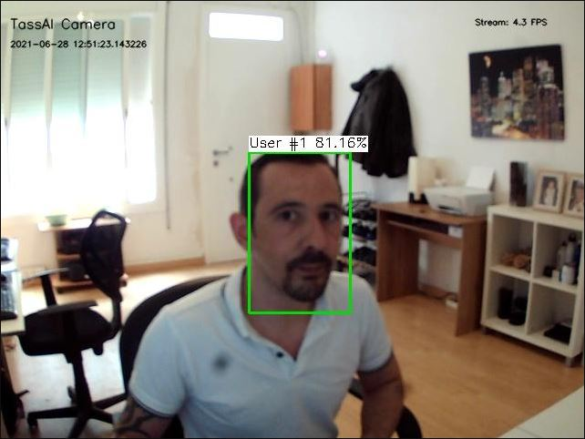
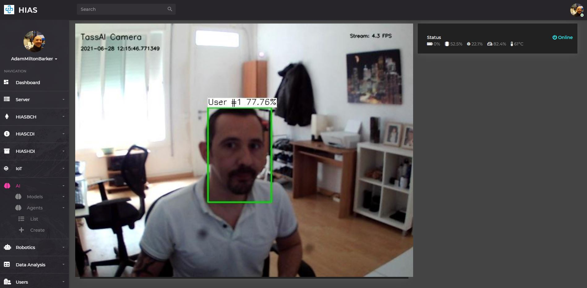

# Usage (USB Camera Mode)


# Introduction
This guide will guide you through using the **HIAS TassAI Facial Recognition Agent USB Camera Mode**. Make sure that you have your NCS/NCS2 and USB camera plugged in before you continue with this guide.

&nbsp;

# Start the Agent

Now you are ready to fire up your **HIAS TassAI Facial Recognition Agent**, to do so use the following command:

``` bash
sudo systemctl start HIAS-TassAI-Facial-Recognition-Agent.service
```

The Agent will now sit listening for all data coming from the HIAS network using the AMQP protocol. Once it receives data it verifies authorization via HIASBCH and sends the data to HIASCDI & HIASHDI.

# Manage the Agent

To manage the agent you can use the following commands:

``` bash
sudo systemctl restart HIAS-TassAI-Facial-Recognition-Agent.service
sudo systemctl stop HIAS-TassAI-Facial-Recognition-Agent.service
```

&nbsp;

# View the local stream



With your **HIAS TassAI Facial Recognition Agent** now online, you can view the local stream by visiting:

```
http://YourIP:YourPort?stream.mjpg
```

&nbsp;

# View stream in HIAS Viewer



Now you have seen your local stream is working, you can now view your stream from within the HIAS UI with HIAS Viewer. To do so, login to the HIAS UI and navigate to **AI->Agents->List** and click on the `Viewer` button for the relevant Agent.

&nbsp;

# Contributing
Asociación de Investigacion en Inteligencia Artificial Para la Leucemia Peter Moss encourages and welcomes code contributions, bug fixes and enhancements from the Github community.

Please read the [CONTRIBUTING](https://github.com/AIIAL/HIAS-TassAI-Facial-Recognition-Agent/blob/master/CONTRIBUTING.md "CONTRIBUTING") document for a full guide to forking our repositories and submitting your pull requests. You will also find information about our code of conduct on this page.

## Contributors
- [Adam Milton-Barker](https://www.leukemiaairesearch.com/association/volunteers/adam-milton-barker "Adam Milton-Barker") - [Asociación de Investigacion en Inteligencia Artificial Para la Leucemia Peter Moss](https://www.leukemiaresearchassociation.ai "Asociación de Investigacion en Inteligencia Artificial Para la Leucemia Peter Moss") President/Founder & Lead Developer, Sabadell, Spain

&nbsp;

# Versioning
We use SemVer for versioning.

&nbsp;

# License
This project is licensed under the **MIT License** - see the [LICENSE](https://github.com/AIIAL/HIAS-TassAI-Facial-Recognition-Agent/blob/master/LICENSE "LICENSE") file for details.

&nbsp;

# Bugs/Issues
We use the [repo issues](https://github.com/AIIAL/HIAS-TassAI-Facial-Recognition-Agent/issues "repo issues") to track bugs and general requests related to using this project. See [CONTRIBUTING](https://github.com/AIIAL/HIAS-TassAI-Facial-Recognition-Agent/blob/master/CONTRIBUTING.md "CONTRIBUTING") for more info on how to submit bugs, feature requests and proposals.